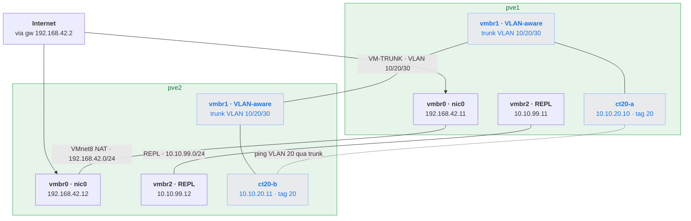

# Sơ đồ kiến trúc mạng (Network Topology)

```mermaid
flowchart TB
    Internet["<b>Internet</b><br/>via gw 192.168.42.2"]

    subgraph pve1 ["pve1"]
        direction TB
        p1_v0["<b>vmbr0 · nic0</b><br/>192.168.42.11"]
        p1_v2["<b>vmbr2 · REPL</b><br/>10.10.99.11"]
        p1_v1["<b>vmbr1 · VLAN-aware</b><br/>trunk VLAN 10/20/30"]
        ct20a["<b>ct20-a</b><br/>10.10.20.10 · tag 20"]
        p1_v1 --- ct20a
    end

    subgraph pve2 ["pve2"]
        direction TB
        p2_v0["<b>vmbr0 · nic0</b><br/>192.168.42.12"]
        p2_v2["<b>vmbr2 · REPL</b><br/>10.10.99.12"]
        p2_v1["<b>vmbr1 · VLAN-aware</b><br/>trunk VLAN 10/20/30"]
        ct20b["<b>ct20-b</b><br/>10.10.20.11 · tag 20"]
        p2_v1 --- ct20b
    end

    Internet --> p1_v0 & p2_v0
    p1_v0 ---|"VMnet8 NAT · 192.168.42.0/24"| p2_v0
    p1_v2 ---|"REPL · 10.10.99.0/24"| p2_v2
    p1_v1 ---|"VM-TRUNK · VLAN 10/20/30"| p2_v1
    ct20a -.-|"ping VLAN 20 qua trunk"| ct20b

    classDef nodeBox fill:#e6f4ea,stroke:#34a853,stroke-width:1px,color:#137333
    classDef vlanBox fill:#e8eaed,stroke:#8ab4f8,stroke-width:1px,color:#1a73e8
    class pve1,pve2 nodeBox
    class p1_v1,p2_v1,ct20a,ct20b vlanBox
```

*Ghi chú: Các khối màu xanh dương đại diện cho lưu lượng VM (VLAN).*